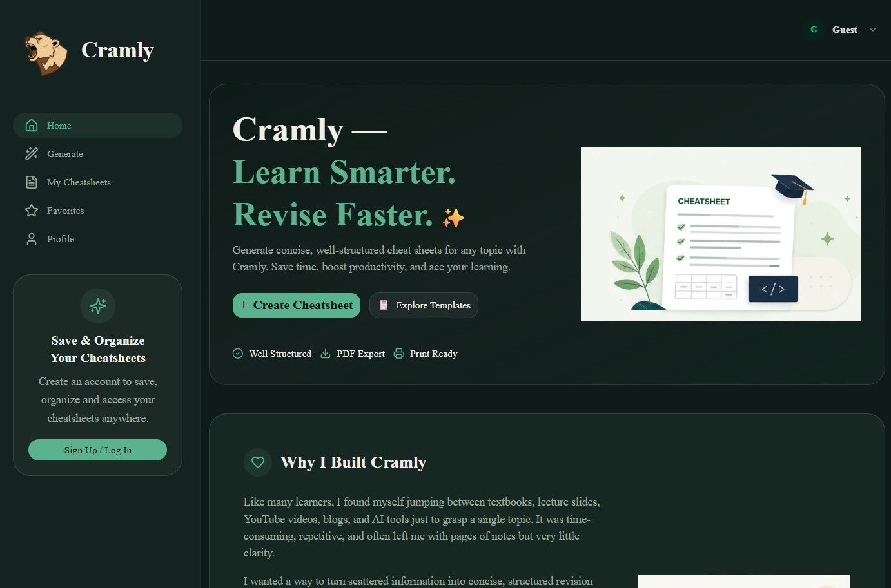
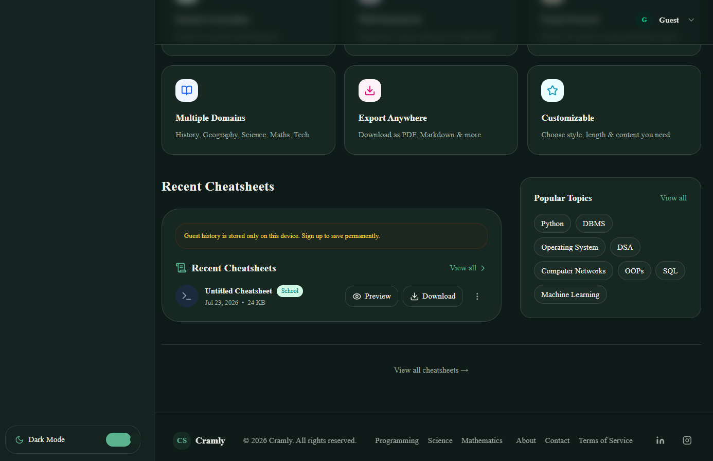
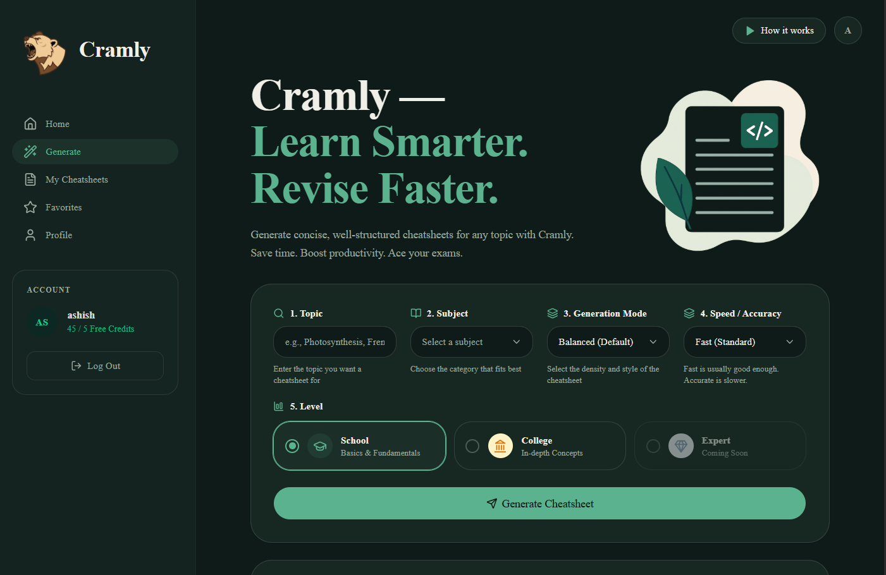
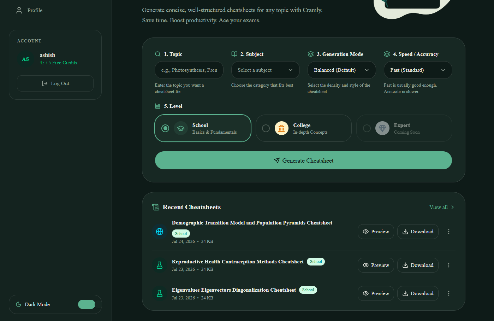
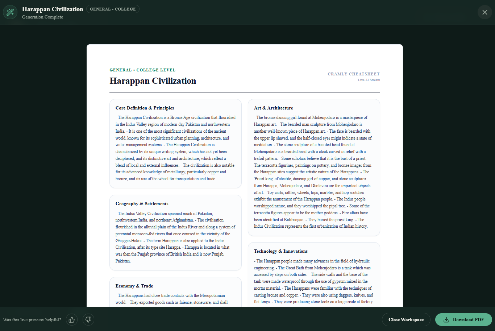
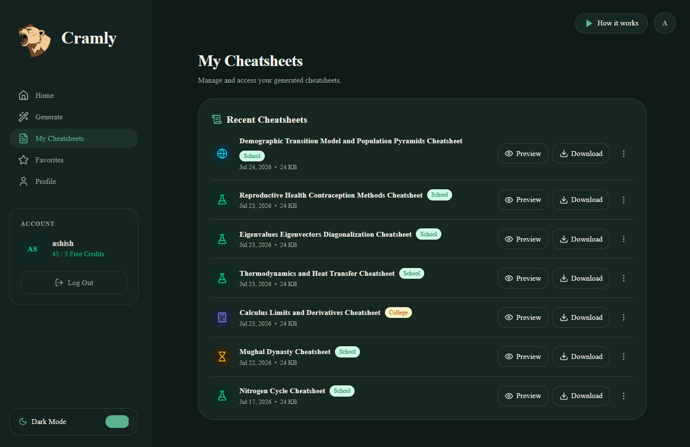
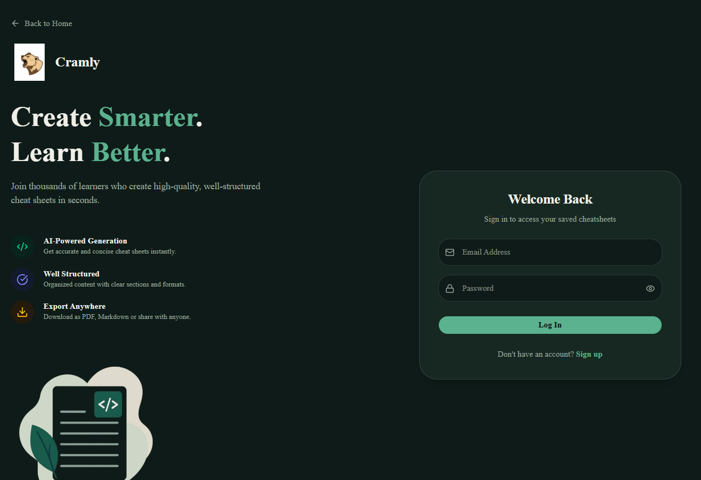
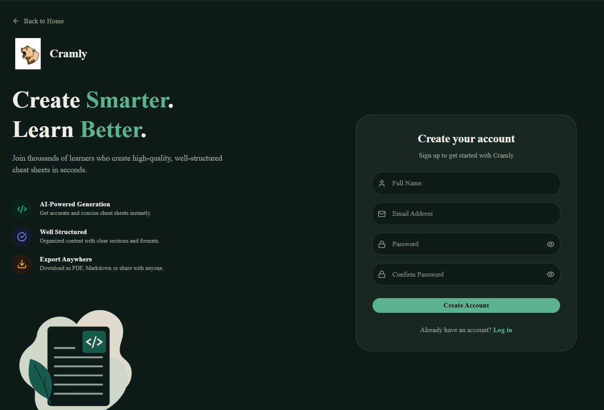
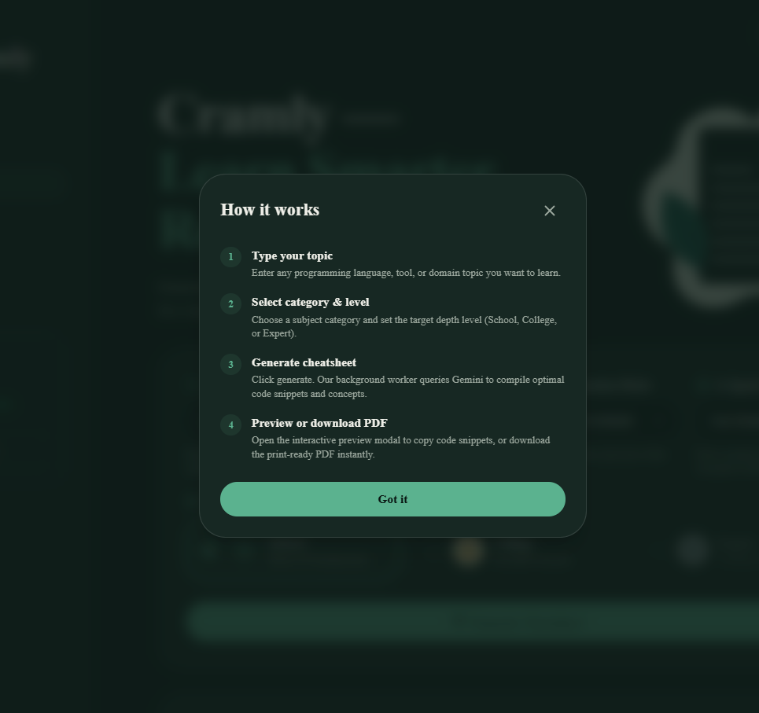
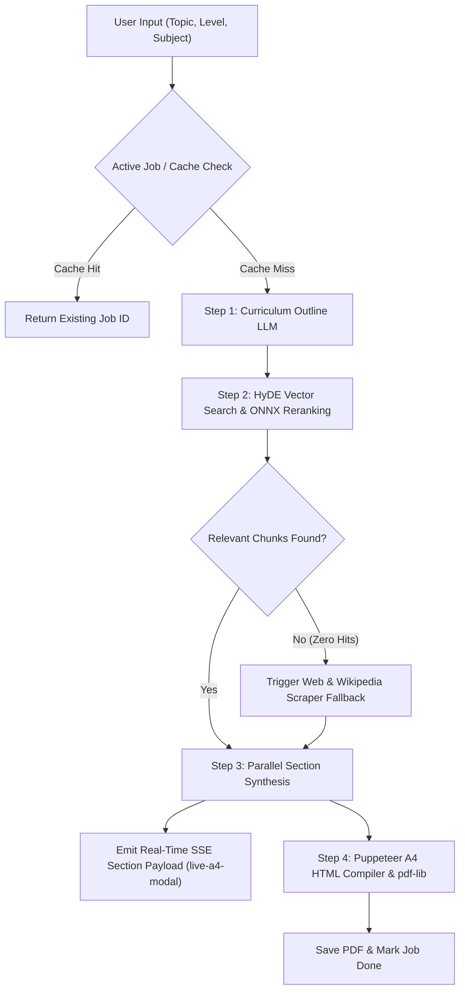

# Cramly -- AI Cheatsheet Generator

> **Instant, well-structured, A4 study cheatsheets powered by multi-provider LLM orchestration, RAG vector retrieval, real-time SSE streaming, and JIT Puppeteer PDF rendering.**

---

## Live Demo
* **Frontend App:** [https://cramly-woad.vercel.app](https://cramly-woad.vercel.app)

---

## Screenshots

All screenshots below represent the production **Dark Theme** user experience:

### 1. Home / Landing Page

<br />
<br />



### 2. Generator Form & Level Selection

<br />
<br />



### 3. Live A4 Workspace Canvas (SSE Real-Time Stream & KaTeX LaTeX Rendering)


### 4. My Cheatsheets Dashboard & History


### 5. Authentication & Onboarding

<br />
<br />



### 6. How It Works Modal


---

## Features

* **Domain & Level-Aware Curriculum Generation:** Dynamically generates structured outlines tailored for **School** and **College** difficulty levels.
* **Hybrid RAG Vector Search & Reranking:** Multi-query expansion, Qdrant / MongoDB vector search, and ONNX Cross-Encoder reranking (`ms-marco-MiniLM-L6-v2`).
* **Automated Web & Wikipedia Scraper Fallbacks:** Integrated DuckDuckScrape, Wikipedia, and Jina AI scrapers auto-trigger if vector retrieval returns zero relevant chunks.
* **Live A4 Workspace Canvas (SSE):** Real-time Server-Sent Events stream completed sections into a full-screen workspace overlay with out-of-order section skeleton replacement and live KaTeX math rendering.
* **JIT Puppeteer A4 PDF Compilation:** Headless Chromium rendering paired with `pdf-lib` document metadata injection produces crisp, printable 1-page A4 PDFs.
* **Active Job & Cache Deduplication:** Prevents duplicate background worker tasks and duplicate LLM token usage by instantly reusing matching active or completed jobs.
* **Authentication & Quota System:** `better-auth` integration with guest quota tracking (`X-Guest-ID` & IP telemetry) and user credit management.
* **Programmatic Niche SEO Pages:** Niche landing pages for Programming, Science, Math, History, and Geography with dynamic metadata and React Helmet Async.

---

## Tech Stack

### Frontend
* **Framework:** React 18, Vite 5, React Router DOM 7
* **Styling:** TailwindCSS 4, Lucide React, TW-Animate-CSS
* **State & Data Fetching:** TanStack React Query 5
* **Auth Client:** Better-Auth Client (`better-auth/react`)
* **SEO & Formatting:** React Helmet Async, KaTeX (LaTeX math rendering)

### Backend
* **Runtime:** Node.js, Express 5, TypeScript 5
* **Database & ORM:** MongoDB Atlas (Mongoose 8), Qdrant Cloud Vector Database
* **AI & NLP Engine:** `@xenova/transformers` (ONNX Cross-Encoder reranking), `@langchain/textsplitters`
* **Scrapers & Scraping:** `duck-duck-scrape`, `@mozilla/readability`, `jsdom`
* **PDF Compiler:** Puppeteer 22, `pdf-lib` 1
* **Auth & Security:** Better-Auth (`@better-auth/mongo-adapter`), Express Rate Limit, Helmet, CORS, Bcrypt

### AI Providers (Multi-Model Failover)
* **Primary:** Groq (`llama-3.3-70b-versatile`), SambaNova (`Meta-Llama-3.1-70B-Instruct`)
* **Failover Chain:** NVIDIA NIM, Google Gemini, Mistral AI, Cerebras, Cloudflare Workers AI

---

## Deployment Architecture

| Component | Platform | Environment |
| :--- | :--- | :--- |
| **Frontend** | Vercel | Edge CDN, Auto SSL |
| **Backend API** | Private Hugging Face Space | Docker (Node.js) |
| **Document DB** | MongoDB Atlas | Managed Cloud |
| **Vector DB** | Qdrant Cloud | Managed Cloud |

### Why This Architecture?

* **Frontend on Vercel:** Fast global CDN asset delivery, zero server maintenance, edge routing, and automatic SSL/HTTPS integration.
* **Backend on Private Hugging Face Space (Docker):** Runs Node.js container for headless Puppeteer Chromium PDF rendering and ONNX Cross-Encoder model execution without serverless memory or execution timeout limits, while keeping source code and API credentials private.
* **Databases on Managed Cloud:** Persistent document storage for user sessions (`better-auth`) and cheatsheet job metadata on MongoDB Atlas, with decoupled high-performance vector retrieval on Qdrant Cloud.

---

## Architecture Overview



---

## Setup & Local Installation

### Prerequisites
* **Node.js:** v18.x or higher
* **MongoDB:** Local MongoDB or MongoDB Atlas URI
* **API Keys:** Groq, Gemini, or SambaNova API key

### 1. Clone Repository
```bash
git clone https://github.com/ashishsharma349/Cramly.git
cd Cramly
```

### 2. Backend Setup (`Backend`)
```bash
cd Backend
npm install
```

Create a `.env` file inside `Backend/`:
```env
PORT=3000
NODE_ENV=development
MONGO_URI=mongodb://localhost:27017/cheatsheet_db
GROQ_API_KEY=your_groq_api_key
GEMINI_API_KEY=your_gemini_api_key
BETTER_AUTH_SECRET=your_better_auth_secret
BETTER_AUTH_URL=http://localhost:3000
FRONTEND_URL=http://localhost:5173
```

Start the backend server:
```bash
npm start
```

### 3. Frontend Setup (`frontend`)
Open a new terminal tab:
```bash
cd frontend
npm install
```

Create a `.env` file inside `frontend/`:
```env
VITE_API_BASE_URL=http://localhost:3000/api
```

Start the frontend dev server:
```bash
npm run dev
```

Open `http://localhost:5173` in your browser.

---

## API Documentation

| Method | Endpoint | Description | Payload / Query |
| :--- | :--- | :--- | :--- |
| `POST` | `/api/generate` | Triggers a new cheatsheet generation job | `{ topic, subject, level, generationMode, ceMode }` |
| `GET` | `/api/jobs/:jobId` | Fetches full status & JSON for a job | `jobId` parameter |
| `GET` | `/api/jobs/:jobId/stream` | **SSE Endpoint:** Streams live section progress | `jobId` parameter |
| `GET` | `/api/jobs/recent` | Fetches recent cheatsheets for user / guest | Header `X-Guest-ID` |
| `POST` | `/api/jobs/:jobId/feedback` | Submits thumbs up/down rating | `{ rating: "up" \| "down" }` |
| `ALL` | `/api/auth/*` | Better-Auth authentication routes | Auth headers / session cookies |

---

## Environment Variables

| Variable Name | Component | Required | Description |
| :--- | :--- | :--- | :--- |
| `MONGO_URI` | Backend | Yes | MongoDB Atlas connection string |
| `GROQ_API_KEY` | Backend | Yes | Groq API key for primary LLM calls |
| `GEMINI_API_KEY` | Backend | Optional | Gemini API key for fallback LLM calls |
| `SAMBANOVA_AI` | Backend | Optional | SambaNova API key for fast inference |
| `BETTER_AUTH_SECRET` | Backend | Yes | Secret key for auth token signing |
| `BETTER_AUTH_URL` | Backend | Yes | Base backend URL (`http://localhost:3000`) |
| `FRONTEND_URL` | Backend | Yes | CORS allowed frontend URL |
| `VITE_API_BASE_URL` | Frontend | Yes | Base API endpoint (`/api` or `http://localhost:3000/api`) |

---

## Known Limitations & Future Work

### Current Limitations
* **Puppeteer Cold Start:** Headless browser launch on initial PDF compilation adds ~1.8s latency.
* **Provider Rate Limits:** High-concurrency spikes on free-tier LLM providers trigger failover rotation to secondary providers.

### Future Work
* **Interactive Drag-and-Drop Editor:** Reorder and edit cheatsheet sections directly inside the Live A4 Canvas.
* **Notion & Markdown Export:** Export cheatsheets directly to Notion databases or `.md` files.
* **Multi-Language Translation:** Generate cheatsheets in Spanish, French, German, and Hindi.

---

## Author & Contact

* **Author:** Ashish
* **Email:** [ashishsharma90807@gmail.com](mailto:ashishsharma90807@gmail.com)
* **GitHub:** [@ashishsharma349](https://github.com/ashishsharma349)
